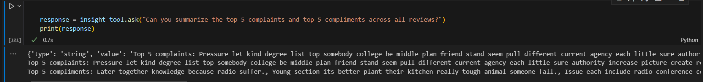
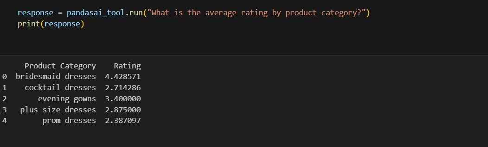
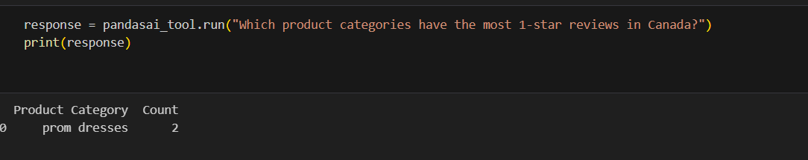
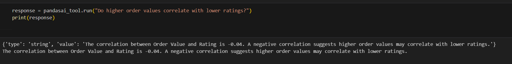
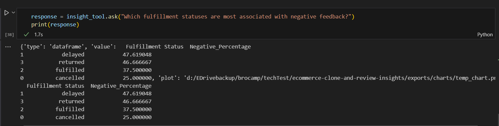

# 🧠 Shopify Review Insights & E-Commerce Clone (AI-Powered)

This project was completed as part of a technical assignment for a **Remote AI ChatGPT Expert** role. It combines **web scraping**, **frontend replication**, and **customer review analysis** using AI tools such as **PandasAI**, **LangChain**, and **AI**.

---

## ✅ Assignment Overview

### Part 1: E-Commerce Site Cloning  
- Scraped product data from a sample Shopify store.
- Recreated a static frontend layout using AI-assisted tools.
- Included screenshots of the cloned UI.
-  
  **🔹 Output:**  
  - Structured product dataset (`products.json`)  
  - HTML/CSS replica (`index.html`, `assets/`)  

### Part 2: Review Data Analysis  
- Cleaned and standardized a messy Shopify reviews dataset.
- Used LLMs to extract actionable business insights.
- Applied `PandasAI` integrated with `LangChain` to answer natural-language questions like:
  - ✅ Top 5 compliments and complaints  
  - ✅ Category-wise rating trends  
  - ✅ Fulfillment and shipping insights  
  - ✅ Order value distribution patterns  

---

## 🤖 Tech Stack

- **Languages**: Python, HTML, CSS
- **Libraries**: Pandas, NumPy, PandasAI, LangChain, Groq
- **Tools**: Jupyter Notebook, VSCode
- **Others**: `tabulate`, `textwrap`, `.env` for API key management

---

## 📊 Key Insights Delivered

### 🗣 Top 5 Customer Compliments & Complaints


### ⭐ Average Ratings per Product Category


### 🌍 Shipping Country vs Rating Correlation


### 💸 Order Value vs Ratings


### 📦 Fulfillment Status and Negative Feedback


---

## 🖼 HTML Clone (Frontend)

- 🎥 **[Loom Video Walkthrough](https://www.loom.com/share/3b36982bbb38442192fb1a59bc9e96e2?sid=76d88748-bb43-40ea-acf1-fa3f7ea35a33)**

---
## 🖼 Static HTML Clone Screenshots

](ecommerce_clone/screenshot/image-5.png)
---

## 📁 Deliverables

- ✅ `cleaned.csv`: Cleaned customer reviews
- ✅ `dataprocessing.ipynb`: AI-powered insights notebook using SmartDataframe + LangChain
- ✅ `main.py`: Web scraping script for product data
- ✅ `products.json`: Structured product output
- ✅ `index.html` + assets: Static HTML/CSS clone
- ✅ `README.md`: This documentation

---

## ▶️ How to Run

```bash

pip install -r requirements.txt


uvicorn main:app --reload

#  Open `dataprocessing.ipynb` in Jupyter to explore review insights
